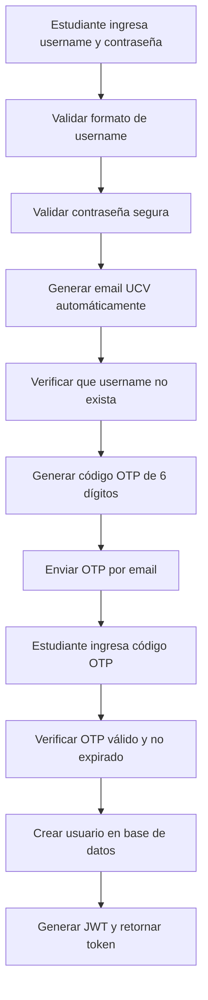

# 🍔 FoodV - Backend API

> **Sistema de Delivery para la Universidad César Vallejo**

Backend completo desarrollado en Spring Boot para la aplicación móvil de delivery FoodV, diseñado específicamente para estudiantes y personal de la Universidad César Vallejo. Permite realizar pedidos al minimarket "Listo", la dulcería "Fresco" y a emprendedores universitarios.

## 📋 Tabla de Contenidos

- [Características](#-características)
- [Tecnologías](#-tecnologías)
- [Arquitectura](#-arquitectura)
- [Módulos Implementados](#-módulos-implementados)
- [Sistema de Autenticación UCV](#-sistema-de-autenticación-ucv)
- [Instalación y Configuración](#-instalación-y-configuración)
- [API Endpoints](#-api-endpoints)
- [Datos de Prueba](#-datos-de-prueba)
- [Pruebas con Postman](#-pruebas-con-postman)
- [Estructura del Proyecto](#-estructura-del-proyecto)
- [Configuración de Producción](#-configuración-de-producción)
- [Solución de Problemas](#-solución-de-problemas)

## 🚀 Características

- **🔐 Autenticación JWT**: Sistema seguro de autenticación con tokens JWT
- **🎓 Autenticación UCV**: Sistema específico para estudiantes UCV con validación de username y OTP
- **📧 Envío de Emails**: Sistema de verificación por email con códigos OTP
- **🛒 Carrito de Compras**: Gestión completa del carrito con cálculos automáticos
- **📦 Gestión de Pedidos**: Sistema completo de pedidos con estados
- **🏪 Múltiples Tiendas**: Soporte para minimarket, dulcería y emprendedores
- **🔍 Búsqueda Avanzada**: Búsqueda de productos por nombre y categoría
- **📱 API REST**: Endpoints RESTful completamente documentados
- **🛡️ Seguridad**: Configuración de seguridad robusta con Spring Security
- **📊 Validación**: Validación completa de datos con Hibernate Validator
- **🌱 Datos de Prueba**: Seeds automáticos para desarrollo y testing

## 🛠️ Tecnologías

| Tecnología | Versión | Descripción |
|------------|---------|-------------|
| **Java** | 21+ | Lenguaje de programación |
| **Spring Boot** | 3.5.6 | Framework principal |
| **Spring Security** | 6.x | Autenticación y autorización |
| **Spring Data JPA** | 3.x | ORM y persistencia |
| **Spring Mail** | 3.x | Envío de emails |
| **PostgreSQL** | 12+ | Base de datos |
| **Maven** | 3.6+ | Gestión de dependencias |
| **JWT** | 0.11.5 | Tokens de autenticación |
| **Lombok** | - | Reducción de código boilerplate |
| **Hibernate Validator** | - | Validación de datos |
| **SpringDoc OpenAPI** | 2.8.9 | Documentación de API |

## 🏗️ Arquitectura

```
┌─────────────────┐    ┌─────────────────┐    ┌─────────────────┐
│   Controllers   │────│     Services    │────│   Repositories │
│   (REST API)    │    │   (Business)    │    │   (Data Access) │
└─────────────────┘    └─────────────────┘    └─────────────────┘
         │                       │                       │
         │                       │                       │
         ▼                       ▼                       ▼
┌─────────────────┐    ┌─────────────────┐    ┌─────────────────┐
│      DTOs       │    │    Entities    │    │   PostgreSQL    │
│  (Data Transfer)│    │   (JPA Models) │    │   (Database)    │
└─────────────────┘    └─────────────────┘    └─────────────────┘
         │                       │                       │
         │                       │                       │
         ▼                       ▼                       ▼
┌─────────────────┐    ┌─────────────────┐    ┌─────────────────┐
│   Email Service │    │    OTP Service  │    │   Gmail SMTP    │
│   (Notifications)│    │   (Security)   │    │   (Email)       │
└─────────────────┘    └─────────────────┘    └─────────────────┘
```

## 📦 Módulos Implementados

### 1. 🔐 Autenticación y Usuarios
- **Registro tradicional** con validación de email
- **Registro UCV** con validación de username y OTP por email
- **Login con JWT** y gestión de tokens
- **Perfil de usuario** con roles (CLIENTE, ADMIN)
- **Seguridad** con Spring Security 6
- **Envío de emails** con códigos OTP de verificación

### 2. 🏪 Gestión de Tiendas
- **Listado de tiendas** (Listo, Fresco, Emprendedores)
- **Búsqueda por tipo** (MINIMARKET, DULCERIA, EMPRENDEDOR)
- **Gestión de estado** activo/inactivo
- **Información detallada** de cada tienda

### 3. 🛍️ Catálogo de Productos
- **Listado de productos** por tienda
- **Búsqueda avanzada** por nombre y descripción
- **Gestión de stock** y precios
- **Imágenes de productos** (URLs)
- **Filtros por tienda** y estado

### 4. 🛒 Carrito de Compras
- **Agregar/quitar productos** del carrito
- **Actualizar cantidades** con validación de stock
- **Cálculo automático** de totales y subtotales
- **Persistencia** del carrito por usuario
- **Validación de stock** antes de agregar

### 5. 📦 Gestión de Pedidos
- **Crear pedidos** desde el carrito
- **Selección de lugar de entrega** (pabellón, piso, salón)
- **Estados de pedido**: PENDIENTE, PREPARANDO, EN_CAMINO, ENTREGADO, CANCELADO
- **Historial de pedidos** del cliente
- **Actualización automática** de stock
- **Notas del pedido** opcionales

## 🎓 Sistema de Autenticación UCV

### Características del Sistema UCV

El sistema está diseñado específicamente para estudiantes de la Universidad César Vallejo con las siguientes características:

#### **Validación de Username UCV**
- **Formato**: Solo letras mayúsculas y números (ej: `XMONTANOGA`)
- **Longitud**: Entre 3 y 20 caracteres
- **Patrón**: `^[A-Z0-9]+$`

#### **Validación de Contraseña Segura**
- **Longitud mínima**: 8 caracteres
- **Requisitos obligatorios**:
  - Al menos una letra minúscula
  - Al menos una letra mayúscula
  - Al menos un número
  - Al menos un símbolo (@$!%*?&)
- **Patrón**: `^(?=.*[a-z])(?=.*[A-Z])(?=.*\\d)(?=.*[@$!%*?&])[A-Za-z\\d@$!%*?&]{8,}$`

#### **Generación Automática de Email UCV**
- **Formato**: `{username}@ucvvirtual.edu.pe`
- **Ejemplo**: `XMONTANOGA@ucvvirtual.edu.pe`

#### **Sistema de Verificación OTP**
- **Código**: 6 dígitos numéricos
- **Expiración**: 10 minutos
- **Envío**: Por email automático
- **Seguridad**: Códigos únicos por sesión

### Flujo de Registro UCV



## ⚙️ Instalación y Configuración

### Prerrequisitos

- **Java 21+** (OpenJDK o Oracle JDK)
- **Maven 3.6+**
- **PostgreSQL 12+**
- **Gmail Account** (para envío de emails)
- **IntelliJ IDEA** (recomendado) o Eclipse
- **Git** (para clonar el repositorio)

### 1. Configuración de la Base de Datos

#### Crear Base de Datos en PostgreSQL:

```sql
-- Conectar a PostgreSQL como superusuario
psql -U postgres

-- Crear la base de datos
CREATE DATABASE foodv_db
    WITH 
    OWNER = postgres
    ENCODING = 'UTF8'
    LC_COLLATE = 'Spanish_Spain.1252'
    LC_CTYPE = 'Spanish_Spain.1252'
    TABLESPACE = pg_default
    CONNECTION LIMIT = -1;

-- Crear usuario específico (opcional)
CREATE USER foodv_user WITH PASSWORD 'foodv_password';
GRANT ALL PRIVILEGES ON DATABASE foodv_db TO foodv_user;
GRANT ALL PRIVILEGES ON ALL TABLES IN SCHEMA public TO foodv_user;
GRANT ALL PRIVILEGES ON ALL SEQUENCES IN SCHEMA public TO foodv_user;
```

### 2. Configuración de Email (Gmail)

#### Configurar Contraseña de Aplicación:

1. **Habilitar autenticación de 2 factores** en tu cuenta de Gmail
2. **Generar contraseña de aplicación**:
   - Ve a: https://myaccount.google.com/
   - Seguridad → Verificación en 2 pasos
   - Contraseñas de aplicaciones
   - Genera una nueva contraseña para "Mail"
   - **Guarda esta contraseña de 16 caracteres**

#### Configurar Variables de Entorno:

```bash
# Windows (PowerShell)
$env:MAIL_USERNAME="tu-email@gmail.com"
$env:MAIL_PASSWORD="tu-contraseña-de-aplicación"

# Windows (CMD)
set MAIL_USERNAME=tu-email@gmail.com
set MAIL_PASSWORD=tu-contraseña-de-aplicación

# Linux/Mac
export MAIL_USERNAME="tu-email@gmail.com"
export MAIL_PASSWORD="tu-contraseña-de-aplicación"
```

### 3. Configuración del Proyecto

#### Clonar e Importar en IntelliJ:

```bash
# Clonar el repositorio (si está en Git)
git clone <repository-url>
cd foodv

# O simplemente abrir la carpeta del proyecto en IntelliJ
```

#### Configurar en IntelliJ IDEA:

1. **Importar el proyecto**:
   - File → Open → Seleccionar la carpeta del proyecto
   - Seleccionar "Import project from external model" → Maven
   - Click "Next" → "Finish"

2. **Configurar JDK**:
   - File → Project Structure → Project → Project SDK → Java 21
   - Verificar que Maven esté configurado correctamente

3. **Configurar Base de Datos**:
   - Verificar que PostgreSQL esté ejecutándose
   - La configuración de conexión está en `src/main/resources/application.properties`

### 4. Configuración de application.properties

Verificar que el archivo `src/main/resources/application.properties` tenga la configuración correcta:

```properties
# Database Configuration
spring.datasource.url=jdbc:postgresql://localhost:5432/foodv_db
spring.datasource.username=postgres
spring.datasource.password=tu_password_de_postgres
spring.datasource.driver-class-name=org.postgresql.Driver

# JPA Configuration
spring.jpa.hibernate.ddl-auto=update
spring.jpa.show-sql=true
spring.jpa.properties.hibernate.dialect=org.hibernate.dialect.PostgreSQLDialect
spring.jpa.properties.hibernate.format_sql=true

# JWT Configuration
jwt.secret=mySecretKey123456789012345678901234567890
jwt.expiration=86400000

# Email Configuration
spring.mail.host=smtp.gmail.com
spring.mail.port=587
spring.mail.username=${MAIL_USERNAME:tu-email@gmail.com}
spring.mail.password=${MAIL_PASSWORD:tu-contraseña-de-aplicación}
spring.mail.properties.mail.smtp.auth=true
spring.mail.properties.mail.smtp.starttls.enable=true
spring.mail.properties.mail.smtp.ssl.trust=smtp.gmail.com
spring.mail.properties.mail.smtp.ssl.protocols=TLSv1.2

# App Configuration
app.mail.from=noreply@foodv.ucv.edu.pe

# Server Configuration
server.port=8080

# Logging
logging.level.pe.ucv.foodv=DEBUG
logging.level.org.springframework.security=DEBUG
```

### 5. Ejecutar el Proyecto

#### Desde IntelliJ IDEA:
1. **Ejecutar la aplicación**:
   - Click derecho en `FoodVApplication.java`
   - Seleccionar "Run 'FoodVApplication'"
   - O usar el botón ▶️ verde en la barra de herramientas

#### Desde Terminal:
```bash
# Compilar y ejecutar
mvn clean install
mvn spring-boot:run

# O compilar JAR y ejecutar
mvn clean package
java -jar target/foodv-0.0.1-SNAPSHOT.jar
```

#### Verificación de Ejecución:

Deberías ver en la consola:
```
Started FoodVApplication in X.XXX seconds (JVM running for X.XXX)
Usuarios creados exitosamente
Tiendas creadas exitosamente
Productos creados exitosamente
```

## 🔗 API Endpoints

### 🔐 Autenticación (Públicos)

| Método | Endpoint | Descripción | Request Body |
|--------|----------|-------------|--------------|
| `POST` | `/api/auth/register` | Registro tradicional | `{"name": "string", "email": "string", "password": "string"}` |
| `POST` | `/api/auth/login` | Login tradicional | `{"email": "string", "password": "string"}` |
| `POST` | `/api/auth/register-ucv` | **Registro UCV** | `{"username": "string", "password": "string"}` |
| `POST` | `/api/auth/verify-otp` | **Verificar OTP UCV** | `{"username": "string", "otpCode": "string"}` |
| `POST` | `/api/auth/login-username` | **Login con username** | `{"usernameOrEmail": "string", "password": "string"}` |

### 👤 Usuarios (Protegidos)

| Método | Endpoint | Descripción | Headers |
|--------|----------|-------------|---------|
| `GET` | `/api/users/profile` | Obtener perfil del usuario | `Authorization: Bearer {token}` |

### 🏪 Tiendas (Públicos)

| Método | Endpoint | Descripción | Parámetros |
|--------|----------|-------------|------------|
| `GET` | `/api/stores` | Listar todas las tiendas | - |
| `GET` | `/api/stores/{id}` | Obtener tienda por ID | `id` (Long) |
| `GET` | `/api/stores/type/{type}` | Listar tiendas por tipo | `type` (MINIMARKET, DULCERIA, EMPRENDEDOR) |

### 🛍️ Productos (Públicos)

| Método | Endpoint | Descripción | Parámetros |
|--------|----------|-------------|------------|
| `GET` | `/api/products` | Listar todos los productos | - |
| `GET` | `/api/products/{id}` | Obtener producto por ID | `id` (Long) |
| `GET` | `/api/products/store/{storeId}` | Listar productos de una tienda | `storeId` (Long) |
| `GET` | `/api/products/search` | Buscar productos | `q` (String) |
| `GET` | `/api/products/store/{storeId}/search` | Buscar productos en una tienda | `storeId` (Long), `q` (String) |

### 🛒 Carrito (Protegidos)

| Método | Endpoint | Descripción | Headers | Request Body |
|--------|----------|-------------|---------|--------------|
| `GET` | `/api/cart` | Obtener carrito del usuario | `Authorization: Bearer {token}` | - |
| `POST` | `/api/cart/add` | Agregar producto al carrito | `Authorization: Bearer {token}` | `{"productId": Long, "quantity": Integer}` |
| `PUT` | `/api/cart/items/{itemId}` | Actualizar cantidad de item | `Authorization: Bearer {token}` | `{"quantity": Integer}` |
| `DELETE` | `/api/cart/items/{itemId}` | Eliminar item del carrito | `Authorization: Bearer {token}` | - |
| `DELETE` | `/api/cart/clear` | Vaciar carrito | `Authorization: Bearer {token}` | - |

### 📦 Pedidos (Protegidos)

| Método | Endpoint | Descripción | Headers | Request Body |
|--------|----------|-------------|---------|--------------|
| `POST` | `/api/orders` | Crear pedido | `Authorization: Bearer {token}` | `{"pabellon": "string", "piso": "string", "salon": "string", "notes": "string"}` |
| `GET` | `/api/orders` | Listar pedidos del usuario | `Authorization: Bearer {token}` | - |
| `GET` | `/api/orders/{orderId}` | Obtener pedido por ID | `Authorization: Bearer {token}` | - |
| `GET` | `/api/orders/status/{status}` | Listar pedidos por estado | `Authorization: Bearer {token}` | - |

## 🧪 Datos de Prueba

El sistema incluye datos de prueba que se cargan automáticamente al iniciar la aplicación:

### 👥 Usuarios de Prueba

| Email | Contraseña | Rol | Descripción |
|-------|------------|-----|-------------|
| `admin@ucv.edu.pe` | `admin123` | ADMIN | Administrador del sistema |
| `juan.perez@ucv.edu.pe` | `password123` | CLIENTE | Usuario de prueba 1 |
| `maria.garcia@ucv.edu.pe` | `password123` | CLIENTE | Usuario de prueba 2 |

### 🏪 Tiendas de Prueba

| Nombre | Tipo | Descripción | Productos |
|--------|------|-------------|-----------|
| **Listo** | MINIMARKET | Productos básicos para estudiantes | Agua, Gaseosa, Galletas, Chicle, Café |
| **Fresco** | DULCERIA | Snacks y golosinas | Chocolate, Caramelos, Gomitas, Helado |
| **Café del Estudiante** | EMPRENDEDOR | Café y snacks preparados | Café Americano, Café con Leche, Sandwich, Empanada |
| **Snacks Saludables** | EMPRENDEDOR | Productos orgánicos y saludables | Ensalada de Frutas, Yogurt, Barra Energética, Jugo Natural |

## 📮 Pruebas con Postman

### Configuración de Postman

1. **Crear nueva colección**: "FoodV API"
2. **Configurar variables de entorno**:
   - `base_url`: `http://localhost:8080`
   - `token`: (se llenará automáticamente después del login)

### Secuencia de Pruebas Recomendada

#### 1. 🎓 Registro UCV (Nuevo)

```http
POST {{base_url}}/api/auth/register-ucv
Content-Type: application/json

{
    "username": "XMONTANOGA",
    "password": "MiPassword123!"
}
```

**Respuesta esperada:**
```json
{
    "success": true,
    "message": "Proceso iniciado",
    "data": "Código de verificación enviado a XMONTANOGA@ucvvirtual.edu.pe"
}
```

#### 2. 📧 Verificar OTP

```http
POST {{base_url}}/api/auth/verify-otp
Content-Type: application/json

{
    "username": "XMONTANOGA",
    "otpCode": "123456"
}
```

**Respuesta esperada:**
```json
{
    "success": true,
    "message": "Registro completado exitosamente",
    "data": {
        "token": "eyJhbGciOiJIUzI1NiJ9...",
        "type": "Bearer",
        "id": 5,
        "name": "XMONTANOGA",
        "email": "XMONTANOGA@ucvvirtual.edu.pe",
        "role": "CLIENTE"
    }
}
```

#### 3. 🔑 Login con Username

```http
POST {{base_url}}/api/auth/login-username
Content-Type: application/json

{
    "usernameOrEmail": "XMONTANOGA",
    "password": "MiPassword123!"
}
```

#### 4. 🔑 Login con Email UCV

```http
POST {{base_url}}/api/auth/login-username
Content-Type: application/json

{
    "usernameOrEmail": "XMONTANOGA@ucvvirtual.edu.pe",
    "password": "MiPassword123!"
}
```

#### 5. 🔐 Login Tradicional

```http
POST {{base_url}}/api/auth/login
Content-Type: application/json

{
    "email": "test@ucv.edu.pe",
    "password": "password123"
}
```

**⚠️ IMPORTANTE**: Copia el `token` de la respuesta y guárdalo en la variable `{{token}}` para los siguientes requests.

#### 6. 🏪 Listar Tiendas

```http
GET {{base_url}}/api/stores
```

#### 7. 🛍️ Listar Productos

```http
GET {{base_url}}/api/products
```

#### 8. 🔍 Buscar Productos

```http
GET {{base_url}}/api/products/search?q=agua
```

#### 9. 👤 Obtener Perfil

```http
GET {{base_url}}/api/users/profile
Authorization: Bearer {{token}}
```

#### 10. 🛒 Agregar al Carrito

```http
POST {{base_url}}/api/cart/add
Authorization: Bearer {{token}}
Content-Type: application/json

{
    "productId": 1,
    "quantity": 2
}
```

#### 11. 🛒 Ver Carrito

```http
GET {{base_url}}/api/cart
Authorization: Bearer {{token}}
```

#### 12. 📦 Crear Pedido

```http
POST {{base_url}}/api/orders
Authorization: Bearer {{token}}
Content-Type: application/json

{
    "pabellon": "A",
    "piso": "2",
    "salon": "201",
    "notes": "Entregar en la puerta del salón"
}
```

#### 13. 📋 Ver Historial de Pedidos

```http
GET {{base_url}}/api/orders
Authorization: Bearer {{token}}
```

## 📁 Estructura del Proyecto

```
src/main/java/pe/ucv/foodv/
├── 📁 config/                    # Configuración del sistema
│   ├── SecurityConfig.java      # Configuración de Spring Security
│   ├── DataSeeder.java          # Datos de prueba (seeds)
│   └── EmailConfig.java          # Configuración de email
├── 📁 controller/               # Controladores REST
│   ├── AuthController.java     # Autenticación (login/register)
│   ├── UserController.java     # Gestión de usuarios
│   ├── StoreController.java    # Gestión de tiendas
│   ├── ProductController.java  # Gestión de productos
│   ├── CartController.java     # Gestión del carrito
│   ├── OrderController.java    # Gestión de pedidos
│   └── DebugController.java    # Endpoints de debug
├── 📁 dto/                      # DTOs para transferencia de datos
│   ├── AuthResponse.java       # Respuesta de autenticación
│   ├── LoginRequest.java       # Request de login tradicional
│   ├── LoginUsernameRequest.java # Request de login con username
│   ├── RegisterRequest.java    # Request de registro tradicional
│   ├── RegisterUcvRequest.java # Request de registro UCV
│   ├── VerifyOtpRequest.java   # Request de verificación OTP
│   ├── UserResponse.java       # Respuesta de usuario
│   ├── StoreResponse.java      # Respuesta de tienda
│   ├── ProductResponse.java    # Respuesta de producto
│   ├── CartResponse.java       # Respuesta de carrito
│   ├── OrderResponse.java      # Respuesta de pedido
│   └── ApiResponse.java        # Respuesta genérica de API
├── 📁 exception/               # Manejo de excepciones
│   └── GlobalExceptionHandler.java # Handler global de excepciones
├── 📁 model/entity/            # Entidades JPA
│   ├── User.java              # Entidad Usuario (con username UCV)
│   ├── Store.java             # Entidad Tienda
│   ├── Product.java           # Entidad Producto
│   ├── Cart.java              # Entidad Carrito
│   ├── CartItem.java          # Entidad Item del Carrito
│   ├── Order.java             # Entidad Pedido
│   └── OrderItem.java         # Entidad Item del Pedido
├── 📁 repository/              # Repositorios JPA
│   ├── UserRepository.java    # Repositorio de Usuarios
│   ├── StoreRepository.java   # Repositorio de Tiendas
│   ├── ProductRepository.java # Repositorio de Productos
│   ├── CartRepository.java    # Repositorio de Carritos
│   ├── CartItemRepository.java # Repositorio de Items del Carrito
│   ├── OrderRepository.java   # Repositorio de Pedidos
│   └── OrderItemRepository.java # Repositorio de Items del Pedido
├── 📁 security/                # Configuración de seguridad
│   ├── JwtUtil.java           # Utilidades JWT
│   ├── JwtAuthenticationFilter.java # Filtro de autenticación JWT
│   └── UserDetailsServiceImpl.java # Implementación de UserDetailsService
├── 📁 service/                 # Servicios de negocio
│   ├── AuthService.java       # Servicio de autenticación
│   ├── EmailService.java      # Servicio de envío de emails
│   ├── OtpService.java        # Servicio de códigos OTP
│   ├── StoreService.java      # Servicio de tiendas
│   ├── ProductService.java    # Servicio de productos
│   ├── CartService.java       # Servicio del carrito
│   └── OrderService.java      # Servicio de pedidos
└── FoodVApplication.java      # Clase principal de Spring Boot
```

## 🚀 Configuración de Producción

Para desplegar en producción, actualizar las siguientes propiedades en `application.properties`:

```properties
# Base de datos de producción
spring.datasource.url=jdbc:postgresql://tu-servidor:5432/foodv_db
spring.datasource.username=tu-usuario
spring.datasource.password=tu-password-segura

# JWT secreto más seguro (mínimo 256 bits)
jwt.secret=tu-clave-secreta-muy-larga-y-segura-de-al-menos-32-caracteres
jwt.expiration=86400000

# Configuración de email de producción
spring.mail.host=smtp.gmail.com
spring.mail.port=587
spring.mail.username=${MAIL_USERNAME}
spring.mail.password=${MAIL_PASSWORD}
spring.mail.properties.mail.smtp.auth=true
spring.mail.properties.mail.smtp.starttls.enable=true
spring.mail.properties.mail.smtp.ssl.trust=smtp.gmail.com

# Configuración de servidor
server.port=8080
server.servlet.context-path=/api

# Logging de producción
logging.level.pe.ucv.foodv=INFO
logging.level.org.springframework.security=WARN
logging.level.org.springframework.web=WARN
logging.level.org.hibernate.SQL=WARN

# Configuración de CORS para producción
spring.web.cors.allowed-origins=https://tu-dominio.com
spring.web.cors.allowed-methods=GET,POST,PUT,DELETE,OPTIONS
spring.web.cors.allowed-headers=*
```

### Variables de Entorno Recomendadas

```bash
# Base de datos
DB_URL=jdbc:postgresql://localhost:5432/foodv_db
DB_USERNAME=postgres
DB_PASSWORD=tu_password_segura

# JWT
JWT_SECRET=tu_clave_secreta_muy_larga_y_segura
JWT_EXPIRATION=86400000

# Email
MAIL_USERNAME=tu-email@gmail.com
MAIL_PASSWORD=tu-contraseña-de-aplicación

# Servidor
SERVER_PORT=8080
```

## 🐛 Solución de Problemas

### Error de Conexión a Base de Datos
```
org.postgresql.util.PSQLException: FATAL: password authentication failed
```
**Solución**: 
- Verificar que PostgreSQL esté ejecutándose
- Verificar credenciales en `application.properties`
- Verificar que la base de datos `foodv_db` exista

### Error de Autenticación de Email
```
Authentication failed
```
**Solución**: 
- Verificar que las variables de entorno `MAIL_USERNAME` y `MAIL_PASSWORD` estén configuradas
- Verificar que la contraseña de aplicación de Gmail sea correcta (16 caracteres sin espacios)
- Verificar que la autenticación de 2 factores esté habilitada en Gmail

### Error de Validación de Username UCV
```
El nombre de usuario debe contener solo letras mayúsculas y números
```
**Solución**: 
- Usar solo letras mayúsculas y números (ej: `XMONTANOGA`)
- No usar caracteres especiales o espacios
- Longitud entre 3 y 20 caracteres

### Error de Validación de Contraseña
```
La contraseña debe contener al menos: 8 caracteres, una letra minúscula, una mayúscula, un número y un símbolo
```
**Solución**: 
- Mínimo 8 caracteres
- Incluir al menos: una minúscula, una mayúscula, un número y un símbolo (@$!%*?&)
- Ejemplo válido: `MiPassword123!`

### Error de OTP Expirado
```
Código OTP inválido o expirado
```
**Solución**: 
- El código OTP expira en 10 minutos
- Solicitar un nuevo código con `/api/auth/register-ucv`
- Verificar que el código sea exactamente de 6 dígitos

### Error 401 Unauthorized
```
{"success":false,"message":"Acceso denegado"}
```
**Solución**: 
- Verificar que el token JWT sea válido
- Verificar que el header `Authorization: Bearer {token}` esté presente
- Verificar que el token no haya expirado
- Hacer login nuevamente para obtener un token fresco

### Error 500 Internal Server Error
```
{"success":false,"message":"Error interno del servidor"}
```
**Solución**: 
- Verificar logs en la consola de IntelliJ para más detalles
- Verificar que la base de datos esté accesible
- Verificar que todas las dependencias estén instaladas
- Verificar configuración de email

### Error de Puerto en Uso
```
Port 8080 was already in use
```
**Solución**: 
- Cambiar el puerto en `application.properties`: `server.port=8081`
- O matar el proceso que usa el puerto 8080

## 📊 Métricas y Monitoreo

### Endpoints de Debug

- `GET /api/debug/otp-status` - Estado de los códigos OTP almacenados

### Logging Recomendado
```properties
# Logging detallado para desarrollo
logging.level.pe.ucv.foodv=DEBUG
logging.level.org.springframework.security=DEBUG
logging.level.org.hibernate.SQL=DEBUG
logging.level.org.hibernate.type.descriptor.sql.BasicBinder=TRACE

# Logging para producción
logging.level.pe.ucv.foodv=INFO
logging.level.org.springframework.security=WARN
logging.level.org.hibernate.SQL=WARN
```

## 🤝 Contribución

### Cómo Contribuir
1. Fork el proyecto
2. Crear una rama para tu feature (`git checkout -b feature/AmazingFeature`)
3. Commit tus cambios (`git commit -m 'Add some AmazingFeature'`)
4. Push a la rama (`git push origin feature/AmazingFeature`)
5. Abrir un Pull Request

### Estándares de Código
- Seguir las convenciones de Java
- Documentar métodos públicos
- Escribir tests unitarios
- Usar nombres descriptivos para variables y métodos

## 📄 Licencia

Este proyecto está bajo la Licencia MIT. Ver el archivo `LICENSE` para más detalles.

## 👥 Equipo de Desarrollo

- **Desarrollador Principal**: [Tu Nombre]
- **Universidad**: Universidad César Vallejo
- **Proyecto**: FoodV - Sistema de Delivery

## 📞 Contacto

Para soporte técnico o consultas sobre el proyecto:

- **Email**: [tu-email@ucv.edu.pe]
- **GitHub**: [tu-usuario-github]
- **Universidad**: Universidad César Vallejo

---

## 🎯 Roadmap Futuro

### Próximas Características
- [ ] **Notificaciones Push**: Integración con Firebase Cloud Messaging
- [ ] **Pagos**: Integración con pasarelas de pago
- [ ] **Geolocalización**: Tracking de pedidos en tiempo real
- [ ] **Chat**: Sistema de mensajería entre cliente y tienda
- [ ] **Reviews**: Sistema de calificaciones y comentarios
- [ ] **Promociones**: Sistema de cupones y descuentos
- [ ] **Analytics**: Dashboard de métricas y reportes
- [ ] **Multi-idioma**: Soporte para múltiples idiomas

### Mejoras Técnicas
- [ ] **Redis**: Cache para mejorar rendimiento
- [ ] **RabbitMQ**: Cola de mensajes para notificaciones
- [ ] **Docker**: Containerización de la aplicación
- [ ] **Kubernetes**: Orquestación de contenedores
- [ ] **CI/CD**: Pipeline de integración continua
- [ ] **Tests**: Cobertura de tests del 90%+
- [ ] **Documentación**: API documentation con Swagger/OpenAPI

---

**¡Gracias por usar FoodV! 🍔✨**